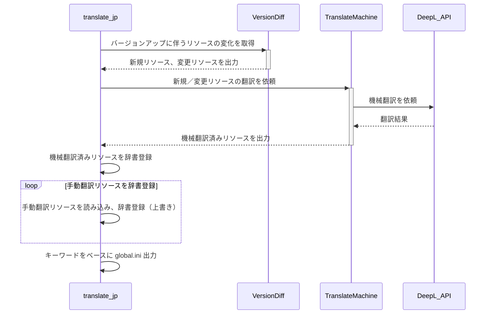

# StarCitizenJapaneseResources

>　以下の文章は将来に向けて実装する内容が含まれています。  
>　現時点では下記記載内容ほど高度な機能はありませんので、ご了承ください。

## 翻訳ツールについて

　翻訳ツールはバージョン間のリソース変化を検出し、すでに翻訳済みのリソースがある場合それをマージし、未翻訳リソースについて機械翻訳をかけ、新しいリソースを作成します。

　速度の関係上、本ツールでは stdblue の趣味で Julia スクリプト言語を利用しています。  
　ですが、あくまで趣味なので、別の言語への変更は Welcome です。  

　現行では翻訳機能として DeepL API(有料) を利用しています。  
　財布に優しい API が別途あればお知らせください。  

### 使い方

```[Julia]
julia translate_jp.jl 最新バージョンglobal.ini 前翻訳バージョンglobal.ini [前翻訳glibal.ini] [手動翻訳テキスト] > global.ini
```

### 処理フロー



### 製作

2023/10/12 stdblue 新規作成

